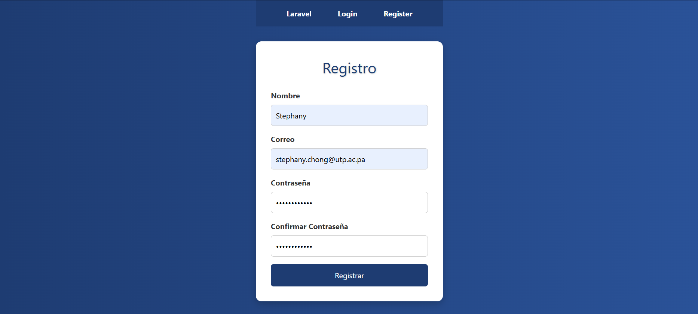

## Laboratorio 2 – Implementación de Login en Laravel  

### Introducción
Este repositorio contiene la solución para el Laboratorio #2 del curso de Ingeniería Web, enfocado en la implementación de un sistema de autenticación de usuarios utilizando el framework Laravel y siguiendo la arquitectura Modelo-Vista-Controlador (MVC).

En este trabajo se busca:  
- Comprender la importancia de documentar proyectos de software.  
- Familiarizarse con la estructura MVC en Laravel (Modelos, Controladores, Vistas y Rutas).  
- Configurar e implementar un módulo de autenticación.  
- Identificar dificultades y soluciones durante la práctica.

### Requisitos previos

- PHP 8.x o superior  
- Composer instalado y configurado  
- Servidor local (XAMPP, WAMP, Laragon o equivalente)  
- Editor de código (Visual Studio Code recomendado)  
- Base de datos MySQL/MariaDB en funcionamiento  
- Node.js y NPM (si se usó Laravel UI/Breeze con Bootstrap o Tailwind)  
- Conexión a internet para instalación de dependencias 

## Instalación y Configuración

1. Instalar dependencias del proyecto
Esto es lo primero que se hace cuando se abre un proyecto Laravel.
- composer install
   
2. Configurar el archivo .env
- cp .env.example .env
- php artisan key:generate

3. Instalar el paquete de autenticación
- composer require laravel/ui
- php artisan ui bootstrap --auth
- npm install && npm run dev

4. Migraciones
- php artisan migrate # (tener el servidor de BD encendido)

5. Pasos de configuración adicionales
- php artisan config:clear
- php artisan config:cache
- php artisan view:clear
- php artisan serve     # iniciar el servidor de Laravel

### Resultado del laboratorio
Pantalla de bienvenida funcionando: 

Pantalla del login funcionando: 

Pantalla de registro funcionando: 

Pantalla de inicio funcionando: 

### Dificultades encontradas y solución

1. **Abrir la opción de Registro**

- **Contexto:** El mismo servidor me estaba diciendo que al abrir “Registrar” no me estaba encontrando el archivo
- **Solución:** Tuve que cambiar la dirección del archivo, en vez de que sea scss, se cambió a css

2. **El CSS para Registrar, Login y el registro exitoso**

- **Contexto:** Estaba bastante simple y feo cómo te estaba dando las opciones por default, entonces también por la cantidad de archivos era complicado buscar a cuál había que implementarle el css
- **Solución:** Tuve que cambiar consultar con una inteligencia artificial cuál era el archivo que tenía que implementarle el .css porque también el php era el único que reconocía los cambios y no el archivo css, es por esto que tuve que hacerle demasiados testeos, cambios y consultas.

3. **Dashboard 404 NOT FOUND**

- **Contexto:** Llevaba tanto tiempo cambiando los css porque siempre me tiraba un error en el diseño (sobre todo en la barra de navegación) que llegó un punto que al cambiar tanto el archivo php, hubo un cambio que empezó a tirarme 404 NOT FOUND. Porque me estaba redirigiendo a Dashboard.
- **Solución:**  Volver a cambiar todo el login, crear el css de nuevo y la información porque en vez de salirme las opciones de Registro y Login como tenía anteriormente, sólo me aparecía la opción de Dashboard y son otros minutos valiosos que perdí en solucionar esto.

4. **Registro del nombre en nulo**

- **Contexto:** Como estaba cambiando todo para que me corriera y el formulario me quedara bonito, tenía en mi código que el nombre se estaba registrando como nulo.
- **Solución:**  Nuevamente volver a cambiar todos los códigos buscando lo que tenían “Auth: user()” y me estaba tomando el valor como nulo (en la imagen se puede apreciar) también porque el mismo Servidor me estaba diciendo que en archivo se encontraba el error.

### Referencias
1. Installation - LaRavel 12.X - the PHP framework for web Artisans. (n.d.). Retrieved from https://laravel.com/docs/12.x/installation

2. Laravel tutorial. (n.d.). Retrieved from https://www.tutorialspoint.com/laravel/index.htm

3. Starter Kits - LaRavel 11.X - The PHP Framework for web Artisans. (n.d.). Retrieved from https://laravel.com/docs/11.x/starter-kits

4. Configuration - LaRavel 12.X - the PHP framework for web artisans. (n.d.). Retrieved from https://laravel.com/docs/12.x/configuration

5. Database: Migrations - LaRavel 12.X - the PHP framework for web artisans. (n.d.). Retrieved from https://laravel.com/docs/12.x/migrations
   
### Conclusiones y aprendizajes
Este laboratorio me permitió comprender de una manera más clara el ciclo de vida de una petición en Laravel y cómo el framework gestiona cada paso, desde que el usuario envía una solicitud hasta que recibe una respuesta. También me ayudó a familiarizarme con la estructura de directorios que utiliza Laravel, entendiendo la función de carpetas como app, routes, resources y config, lo cual me dio una visión más organizada de cómo se construye una aplicación. Además, pude reconocer la importancia de una buena configuración del entorno, especialmente en lo referente al archivo .env, ya que allí se centralizan datos sensibles como la conexión a la base de datos o las claves de la aplicación.

Trabajar con Laravel me permitió experimentar de primera mano la utilidad de comandos como los de artisan, que agilizan la creación de controladores, migraciones y otras funcionalidades. 

### Información del estudiante
- Nombre: Stephany Chong
- Correo: stephany.chong@utp.ac.pa
- Curso: Ingeniería Web
- Instructor: Ing. Irina Fong
- Fecha de ejecución: 14/09/2025
